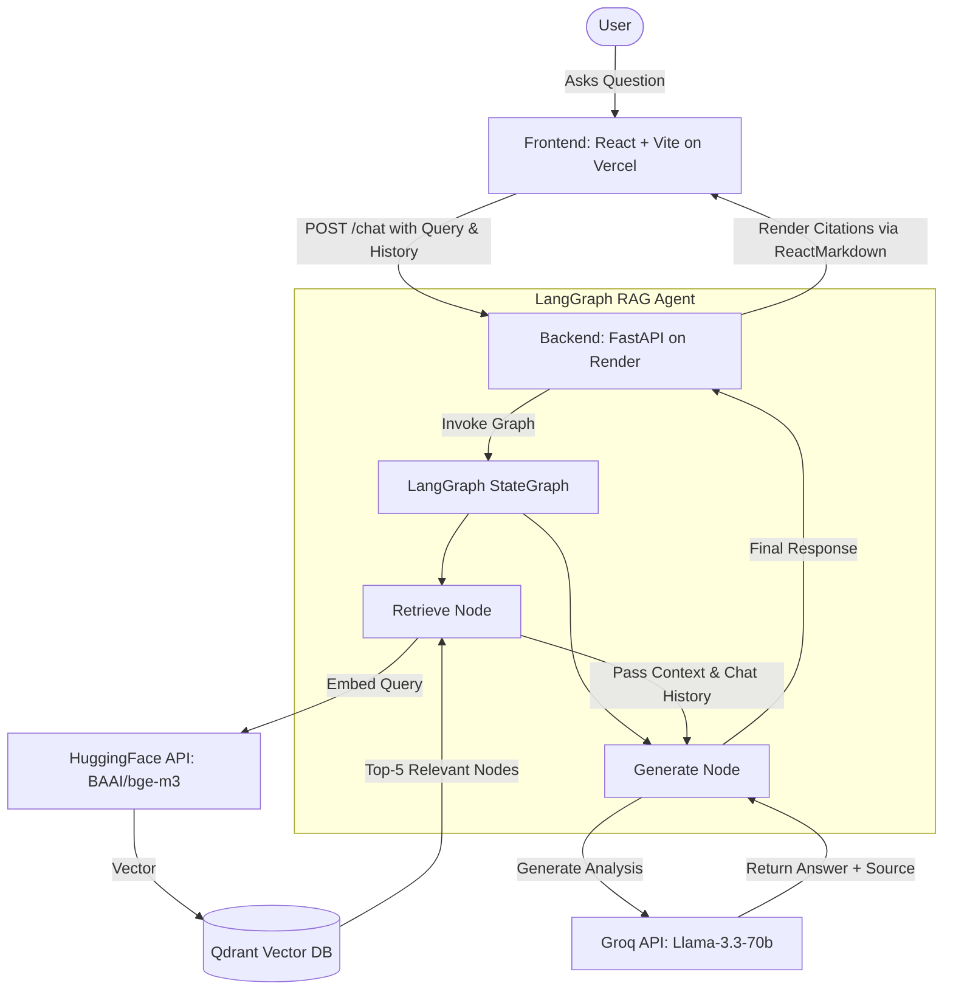

# FinRAG 📈 - Corporate & Financial AI Analyst

> **An Agentic RAG System for Deep Analysis of Vietnamese Corporate Annual Reports**

[](https://finrag-assistant.vercel.app/)
[](https://finrag-backend-sdny.onrender.com/docs)
[](https://python.org)
[](https://react.dev)

## 🌐 Live Demo

- **Frontend App**: [https://finrag-assistant.vercel.app/](https://finrag-assistant.vercel.app/)
- **Backend API Docs**: [https://finrag-backend-sdny.onrender.com/docs](https://finrag-backend-sdny.onrender.com/docs)

---

## 📖 Overview

FinRAG is an advanced AI-powered assistant designed to parse, understand, and analyze complex annual reports. Built as an end-to-end **Agentic RAG (Retrieval-Augmented Generation) pipeline**, it allows users to chat seamlessly with the corporate data of top-tier Vietnamese corporations.

### 📊 Supported Data Sources (2025 Annual Reports)
The system currently hosts the complete annual reports of the following major corporations, encompassing financial metrics, strategic goals, and ESG (Environmental, Social, Governance) directions:
- **Vinamilk** (VNM)
- **Vingroup** (VIC)
- **Hoa Phat** (HPG)
- **MB Bank** (MBB)
- **FPT Corporation** (FPT)

---

## ✨ Key Features

| Feature | Description |
|---------|-------------|
| **Complex Table Parsing** | Utilizes **LlamaParse** to accurately extract and preserve complex financial tables from raw PDF reports. |
| **Agentic State Orchestration** | Employs **LangGraph** for intelligent routing, ensuring robust state management between retrieval and generation. |
| **High-Performance Retrieval** | Uses **Qdrant Cloud** for blazing-fast vector similarity search, enabling instantaneous context fetching. |
| **High-Speed Single-Stage Retrieval** | Utilizes a highly optimized dense vector retrieval (`top_k=5`) with Qdrant to ensure sub-second response times and minimal token consumption for the Groq LLM, providing a blazing-fast user experience. |
| **Fault-Tolerant Retrieval** | A 3-attempt retry loop with a 20-second sleep gracefully handles HuggingFace Inference API cold starts (504 timeouts). |
| **Contextual Memory** | Maintains conversational state by passing `chat_history` to the backend, enabling fluid multi-turn dialogue. |
| **Interactive Citations** | Automatically extracts and renders source document names as beautiful, hoverable UI badges to prevent AI hallucinations. |
| **Rapid AI Inference** | Powered by the highly capable **Llama-3.3-70B-Versatile** model via **Groq's** ultra-fast API architecture. |
| **Memory-Optimized Deployment** | HuggingFace Inference API completely eliminates local PyTorch overhead, running easily within 512MB RAM constraints on Render. |
| **Sleek ChatGPT-Style UI** | Modern frontend built with **React** and **Tailwind CSS**, featuring a collapsible chat session sidebar, dark mode, and rich markdown. |

---

## 🏗️ System Architecture & Workflow

The system relies on a decoupled frontend and backend, using LangGraph to orchestrate Retrieval and Generation intelligently.



### How It Works:
1. **Data Ingestion (Offline)**: PDF annual reports are processed via LlamaParse, vectorized using the `bge-m3` embedding model, and ingested into **Qdrant Cloud** (Collection: `finrag_assistant_v2`).
2. **Query Processing**: The user submits a natural language question. The React UI bundles the current query along with previous chat session context (`chat_history`).
3. **Retrieval**: LangGraph routes to `retrieve_node`, which embeds the query and fetches the top **5** most relevant document chunks from Qdrant (`top_k=5`). A retry loop handles HuggingFace API cold starts transparently.
4. **Generation**: The context and chat history are passed to the `generate_node`. The LLM (Llama-3.3-70B) is instructed to act as a Senior Analyst, strictly appending `[Source: Filename.pdf]` to its factual claims.
5. **Response & UI Parsing**: The final AI response is streamed back to the frontend. A custom Markdown parser detects the citations and converts them into interactive, hoverable badges.

---

## 💻 Tech Stack

| Layer | Technology | Purpose |
|-------|------------|---------|
| **Frontend** | React, Vite, Tailwind CSS | UI components, state management, and styling. |
| **Backend** | FastAPI, Python 3.10+ | High-performance async API routing. |
| **Orchestration** | LangGraph, LangChain | Managing agent states and LLM wrappers. |
| **RAG Pipeline** | LlamaIndex | Core retrieval logic and vector store integration. |
| **Vector DB** | Qdrant Cloud | Scalable cloud database for storing document embeddings. |
| **Embeddings** | HuggingFace Inference API (`BAAI/bge-m3`) | Serverless generation of highly accurate text embeddings. |
| **LLM Provider** | Groq API (`llama-3.3-70b-versatile`) | Lightning-fast inference generation. |

---

## 🚀 Local Development Setup

### Prerequisites
- Python 3.10+
- Node.js 18+
- Accounts/API keys for **Groq**, **Qdrant Cloud**, and **HuggingFace**.

### 1. Backend Setup

```bash
# Navigate to the backend directory
cd backend

# Install dependencies
pip install -r requirements.txt

# Create your environment variables file
cp .env.example .env 
```

**Required `.env` variables:**
```env
QDRANT_URL=your_qdrant_url
QDRANT_API_KEY=your_qdrant_api_key
GROQ_API_KEY=your_groq_api_key
HF_TOKEN=your_huggingface_token
```

```bash
# Start the FastAPI server
uvicorn main:app --reload --host 0.0.0.0 --port 8000
```
*The backend API will run on `http://localhost:8000`*

### 2. Frontend Setup

```bash
# Navigate to the frontend directory
cd frontend

# Install dependencies
npm install

# Start the Vite development server
npm run dev
```
*The frontend will run on `http://localhost:5173`*

---

**Developed for technical demonstration and portfolio showcasing.**
